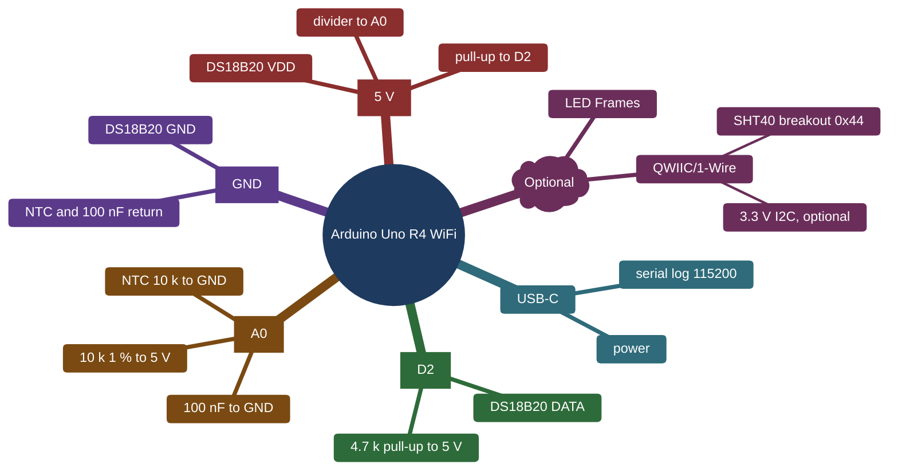

# IoT25S Projekt 1 - MicroHydros climate node

Firmware for an Arduino Uno R4 WiFi that measures inside air temperature
and humidity (SHT40, emulated for now), outside air temperature (DS18B20)
and nutrient water temperature (NTC thermistor), validates the readings and
publishes them over MQTT.

## Plain-language descriptions for the project board

A few terms that appear throughout, explained once:

- The node: the Arduino Uno R4 WiFi board with the three sensors on it.
- Indoor sensor (SHT40): measures air temperature and humidity inside the
  grow space. We do not have the physical part yet, so the firmware
  contains a software stand-in (the "emulator") that produces realistic
  fake readings.
- Outdoor sensor (DS18B20): a digital temperature sensor on a cable,
  measuring air temperature outside the grow space.
- Water sensor (NTC): a small resistor whose resistance changes with
  temperature, sealed into a waterproof probe and dipped in the nutrient
  water.
- The broker (Mosquitto): a small message post office on a PC. The node
  sends its readings there; the backend picks them up.
- The backend (Node-RED + SQLite): the program that receives the readings,
  stores them in a database file, and shows them on a web dashboard.
- Fault code: a small number attached to each reading that says "this
  value is fine" (0) or why it is not (sensor missing, out of range, and
  so on).

---

## Build

PlatformIO project. Install the PlatformIO IDE extension in VS Code or
PlatformIO Core (`pio`).

**One time**
```
    cp src/secrets.h.example src/secrets.h   # fill in Wi-Fi and broker
```
**pio commands:**
```
    pio run                                  # build for uno_r4_wifi
    pio run -t upload                        # flash the board
    pio device monitor                       # serial log, 115200 baud
    pio test -e native                       # PC tests of the pure modules
    pio check -e uno_r4_wifi                 # Runs cppcheck and clangtidy
    or
    pio check -e native
```

Libraries are declared in `platformio.ini` and fetched automatically:
ArduinoMqttClient, OneWire, DallasTemperature. WiFiS3, Wire and
Arduino_LED_Matrix come with the board core.

## Using the device

### Wiring

Power, the serial log and the serial commands all go over the USB-C port.
Pins are set in `src/config.h`; the full table is outline section 7.

| Board pin       | Connects to                        | Notes                                                                                   |
| --------------- | ---------------------------------- | --------------------------------------------------------------------------------------- |
| D2              | DS18B20 data                       | 4.7 k pull-up from D2 to 5 V. Sensor VDD to 5 V, GND to GND (no parasite power)         |
| A0              | NTC divider midpoint               | 10 k 1 % from 5 V to A0, NTC from A0 to GND, 100 nF from A0 to GND against noise        |
| Qwiic (`Wire1`) | SHT40 breakout, when one is fitted | 3.3 V I2C at 0x44. Leave empty while `SHT4X_SIMULATED` is 1 (the default)              |
| LED matrix      | on the board                       | Connection state, fault present, publish blink (see Running)                            |



The NTC probe is a bare 10 k bead on a twisted pair, sealed in two layers
of adhesive heat-shrink. Measure its leakage resistance (megohm range)
before it goes into nutrient solution.

### Setup

1. Have a broker running. The project one is in `backend/`:

        cd backend && docker compose up -d --build

   Any Mosquitto works. Note the LAN IP of the machine it runs on; the
   node must reach it on port 1883.

2. Credentials and broker address:

        cp src/secrets.h.example src/secrets.h

   Fill in `SECRET_SSID`, `SECRET_PASS` and `MQTT_HOST`. The board's
   Wi-Fi module is 2.4 GHz only. `MQTT_USER` and `MQTT_PASS` stay empty
   for the anonymous dev broker.

3. Check `src/config.h`. `DEVICE_ID` must be unique per node; it is the
   middle part of every topic. `SHT4X_SIMULATED` is 1 until a real SHT40
   is on the Qwiic connector. `SAMPLE_INTERVAL_MS` is the default sample
   and publish period.

4. Flash and open the log:

        pio run -t upload
        pio device monitor

### Running

The node boots, prints a banner and warns if a sensor did not answer.
It then walks the connection states and logs every transition:

    state: Boot -> WifiConnecting
    state: WifiConnecting -> MqttConnecting      (SSID, RSSI and IP follow)
    state: MqttConnecting -> Online

If Wi-Fi or the broker drops, the node falls back to the matching state
and retries every 5 s. Sampling and validation continue in every state;
publishing only happens in Online.

One line per sample, default every 10 s, value and fault code per channel:

| seq | uptime_s | t_in | rh_in | t_out | t_water | fault t_in | fault rh_in | fault t_out | fault t_water | sht40 | ds18b20 | ntc |
|---:|---:|---:|---:|---:|---:|---:|---:|---:|---:|---|---|---|
| 19 | 191 | 22.0 | 65.0 | 26.1 | 24.6 | 0 | 0 | 0 | 0 | sim | hw | hw |
| 20 | 201 | 22.0 | 65.0 | 26.3 | 24.6 | 0 | 0 | 0 | 0 | sim | hw | hw |
| 21 | 211 | 22.0 | 65.0 | 26.3 | 24.6 | 0 | 0 | 0 | 0 | sim | hw | hw |
| 22 | 221 | 22.0 | 65.0 | 26.3 | 24.6 | 0 | 0 | 0 | 0 | sim | hw | hw |

Fault codes: 
- `NONE` (valid),
- `NO_DEVICE` (unplugged, no ACK),
- `CRC`, `TIMEOUT` (conversion never finished),
- `RANGE`,
- `RATE`,
- `STUCK`(rejected by validation),
- `NOT_READY` (never sampled).
An invalid channel is published as `null` with its fault code, never as a fake number.

Watch the data from any machine with the mosquitto clients:

    mosquitto_sub -h <broker ip> -t "microhydros/#" -v

Each sample arrives on `microhydros/<device_id>/telemetry` as one flat
JSON object. `microhydros/<device_id>/status` holds `online` or
`offline` (retained; `offline` is the Last Will, so it also appears when
the node loses power). No averaging on the node; the backend stores the
series and averages in queries.

Serial commands (`scenario`, `sample`, `help`, see `ui/SerialCommand.h`)
and the LED matrix frames are stubs and stay so: the parser, the handler
in `main.cpp` and the frames are deprioritized.
The sample period is `SAMPLE_INTERVAL_MS` in `config.h`; the emulator
runs its default `STEADY` scenario.

## Layout

    src/          Arduino-dependent code, one directory per area:
      main.cpp, config.h        scheduler, state machine, settings
      sensors/                  Ds18b20Sensor, NtcSensor, SensorManager
      sensors/sht4x/            Sht4xSensor (adapter), Sht4xHardware (I2C);
                                the emulator and decoder are in lib/Sht4x
      net/                      Network (Wi-Fi), Telemetry (MQTT)
      ui/                       StatusLed (LED matrix), SerialCommand
    lib/          Pure C++ modules that also compile on a PC: Reading types,
                  driver contract, SHT4x decoder and emulator, NTC math,
                  Validity, Payload (JSON builder)
    test/         Unity tests for lib/, run in the native environment
    examples/     Unmodified library examples the modules were derived from
                  (reference only, not built)
    backend/      docker-compose for Mosquitto + Node-RED, see backend/README.md

## Where to start

The headers carry the contracts; the bodies marked `TODO(<area>)` are the
work. Headers under `src/` subdirectories are included with their directory
(`#include "net/Network.h"`); `lib/` headers are included bare. Grep for
your tag:

    TODO(network)    net/Network.cpp: Wi-Fi connect / retry
    TODO(telemetry)  net/Telemetry.cpp: MQTT connect, Last Will, publish, cmd
    TODO(ds18b20)    sensors/Ds18b20Sensor.cpp: async 1-Wire read and fault mapping
    TODO(firmware)   main.cpp: state machine, publish trigger, LED, commands
    TODO(serial)     ui/SerialCommand.cpp: line parser
    TODO(led)        ui/StatusLed.cpp: frames per state
    TODO(validity)   Validity.cpp: range, rate, stuck
    TODO(emulator)   Sht4xSimulated.cpp: scenario model

Each `examples/` directory named in a TODO is the library example to adapt.
The pure modules in `lib/` have tests in `test/test_native`; add a test
when you fill in a `lib/` body. Note that `snprintf("%f")` prints nothing
on this core (newlib-nano), which is why Payload formats numbers itself.

## Contributing

Nothing goes into `main` directly: branch, pull request, one approval,
squash merge. Step by step in `docs/workflow.md`. Native tests and how
to extend them: `docs/native_tests.md`.

## More

Sensor motivation, MQTT payload format, the full wiring table and the test
plan: `docs/projekt1_architecture_outline_v3.md`. Test records:
`docs/tests.md`.
