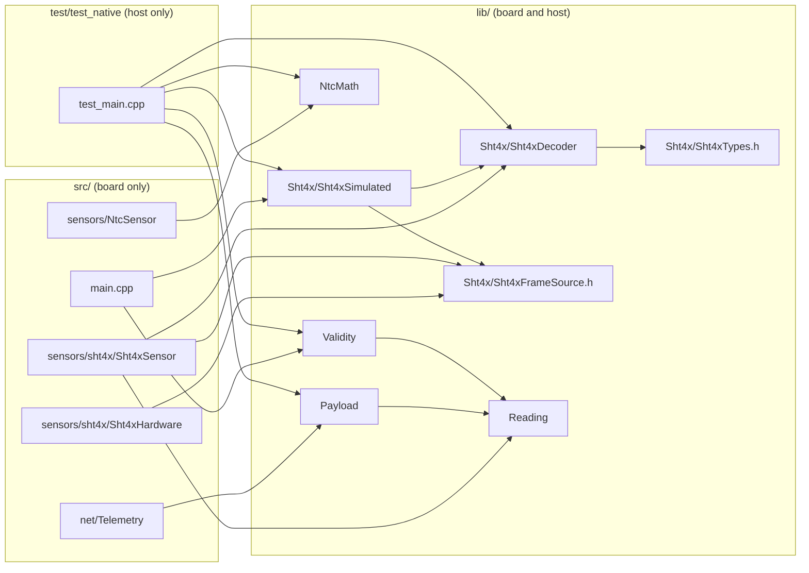

# Native unit tests and the modules they cover

This document explains the PC-side tests in `test/test_native/`, the
modules in `lib/` they exercise, how the build fits together, and how to
extend both when a `lib/` body is filled in or a new module is added.
The test plan itself (what / how / expected / actual for every test level)
is outline section 11; this is the how-it-works and how-to-add-to-it guide
for the component level of that plan.

## 1. What "native" means here

The firmware is split by one question: does this code need the board?

- `src/` touches pins, I2C, 1-Wire, Wi-Fi, MQTT, the LED matrix and the
  serial port. It only compiles for `uno_r4_wifi`.
- `lib/` is plain C++ with no Arduino headers. It compiles for the board
  and for the PC. Everything in it is deterministic given its inputs: time
  is passed in as a `nowMs` argument, randomness is a seeded xorshift, and
  no function reads hardware.

The native tests compile `lib/` with the host `g++` and run it as an
ordinary program. They take a few seconds, need no board, and are the
only automatic tests in the project. The board-level behaviour
(conversion timing, reconnects, unplugged sensors) is covered by the
integration and system tests in outline 11, which are run by hand and
recorded in `tests.md`.

## 2. Running the tests

    pio test -e native

Useful variants:

    pio test -e native -v              print every assertion, not just failures
    pio test -e native --without-building   rerun the last binary

`pio` lives in PlatformIO's own virtualenv. The VS Code PlatformIO
terminal has it on `PATH`; from a plain shell use
`~/.platformio/penv/bin/pio` or add that directory to `PATH`.

Both commands are part of the pre-push checklist in `docs/workflow.md`.

A run prints one line per test function with `[PASSED]` or `[FAILED]`,
then a summary table with the count and the time. A failed assertion
prints the file, the line of the assertion, the test name and the
expected and actual values. The exit code is non-zero when any test
fails, so the command works as a gate in a script or CI job.

`pio test` builds into `.pio/build/native/`, which is git-ignored. A clean
rebuild is `pio run -t clean -e native` followed by the test command.
Do not use `pio run -e native`: that builds `src/` for the host, which
cannot work because `src/` includes Arduino headers.

## 3. How the build fits together

`platformio.ini` has two environments:

| env           | platform     | builds            | purpose                 |
|---------------|--------------|-------------------|-------------------------|
| `uno_r4_wifi` | `renesas-ra` | `src/` and `lib/` | the firmware (default)  |
| `native`      | `native`     | `lib/` and `test/`| the PC tests            |

Relevant settings:

- `[env:native] build_flags = -std=c++17 -Wall -Wextra -DNATIVE_BUILD`.
  `NATIVE_BUILD` is defined but nothing uses it yet. It is there for the
  case where a `lib/` module must behave differently on the PC, guarded
  by `#ifdef NATIVE_BUILD`. Prefer passing the difference in as an
  argument instead; the flag is a last resort.
- `[env:native] test_filter = test_native` and
  `[env:uno_r4_wifi] test_ignore = test_native`: the test directory is
  only ever built for the host. A future on-board test directory would be
  named differently and get the opposite pair of settings.
- `test_build_src` is left at its default (`no`), so `src/` is never
  compiled during `pio test`. This is what lets `lib/` be tested while
  `src/` still contains Arduino-only code.

Which `lib/` modules get compiled is decided by PlatformIO's library
dependency finder: every directory under `lib/` is a library, and a
library is built when a header from it is included, directly or
transitively, by the test program. `test_main.cpp` includes the SHT4x
decoder and emulator, `NtcMath`, `Validity` and `Payload`; `Reading` is
pulled in by the last two. `Sensor/` holds only a header with no code,
so nothing is built for it. Adding a `lib/` directory therefore needs no
change to `platformio.ini`; including its header from the test file is
enough.

Unity, the test framework, is fetched by PlatformIO and compiled into
the test program. Its configuration (`unity_config.h`) is generated, not
part of the repository.



The arrows are `#include` relations. Nothing in `lib/` points at `src/`,
which is the invariant that keeps the native build possible.

## 4. The modules, one by one

Each header carries the module's contract as a comment block. The tests
check the contract, not the implementation, so read the header first
when extending either.

### 4.1 Reading (`lib/Reading/`)

The data types every layer above the drivers works on.

- `enum Fault`: `FAULT_NONE` through `FAULT_NOT_READY`, with
  `FAULT_COUNT` as the bound. Driver-level faults (`NO_DEVICE`, `CRC`,
  `TIMEOUT`) and validity-level faults (`RANGE`, `RATE`, `STUCK`) share
  one code space so the payload can publish a single number per channel.
- `struct Reading`: `value`, `valid`, `fault`, `sampledAtMs`, `raw`.
  `set()` marks a reading valid, `fail()` marks it invalid with a fault
  code and a NaN value. `raw` exists only so stuck detection can compare
  sensor words rather than floats.
- `struct Snapshot`: the four channels plus `seq` and `uptimeMs`.
- `faultName()`: fault code to a short string for the serial log; returns
  `"UNKNOWN"` for codes at or above `FAULT_COUNT`.

Tests: none of its own. It is exercised through the Payload test, which
builds a Snapshot with `set()` and `fail()`. A direct test would be
justified if `faultName()` or the invariants of `set()`/`fail()` ever
grow logic.

### 4.2 Sensor (`lib/Sensor/Sensor.h`)

Header only. It states the driver contract (`begin`, `start`, `ready`,
`read`) in prose because the three drivers are composed statically and do
not share a base class. There is nothing to compile or test; it is the
reference the `src/` drivers and their integration tests are written
against.

### 4.3 SHT4x (`lib/Sht4x/`)

Four files around the sensor's 6-byte response frame.

- `Sht4xTypes.h`: datasheet constants. I2C address, commands, conversion
  time, CRC polynomial and init, the two conversion formulas. No code.
- `Sht4xDecoder.h/.cpp`: pure functions. `crc8()`, `decode()` (frame to
  temperature and humidity, false on either CRC failing, outputs
  untouched on false, humidity clipped to 0..100), the word/physical
  conversions in both directions, and `encode()` which builds a valid
  frame from two words.
- `Sht4xFrameSource.h`: the abstract interface that hides where a frame
  came from. `Sht4xHardware` (in `src/`) implements it over I2C;
  `Sht4xSimulated` implements it in software. The adapter `Sht4xSensor`
  in `src/` only sees this interface, so a CRC error from silicon and
  from the emulator take the same path.
- `Sht4xSimulated.h/.cpp`: the emulator. `startMeasurement()` runs the
  model, encodes a frame and marks it pending; `readFrame()` hands it
  over once. `setScenarioByName()` maps the serial command names
  (`steady`, `heatup`, `cooldown`, `stuck`, `badcrc`) to the enum and
  refuses unknown names. The `BADCRC` scenario corrupts the temperature
  CRC byte after encoding. The model in `model()` is a `TODO(emulator)`
  and currently returns the reference temperature and base humidity for
  every scenario; the noise generator is a deterministic xorshift so
  tests stay repeatable once it is used.

Tests, all present:

| test                                       | checks                                                     |
|--------------------------------------------|------------------------------------------------------------|
| `test_crc8_datasheet_vector`               | `crc8({0xBE,0xEF}) == 0x92`, the vector from the datasheet |
| `test_decode_roundtrip`                    | encode then decode returns the input values within 0.01    |
| `test_decode_rejects_bad_crc`              | one flipped CRC bit gives false and leaves the outputs alone|
| `test_decode_boundary_words`               | 0x0000 and 0xFFFF decode to the formula ends, RH clipped   |
| `test_emulator_steady_decodes_badcrc_fails`| steady frame decodes, badcrc frame does not, unknown name refused |

Missing, waiting on the model: `heatup`, `cooldown` and `stuck`
behaviour (kanban card E2).

### 4.4 NtcMath (`lib/NtcMath/`)

The thermistor divider and beta equation as pure functions over ADC
counts. `Params` holds the series resistor, R0, beta, T0 and a calibration
offset. `adcIsShort()`, `adcIsOpen()` and `adcPlausible()` flag counts
within a margin of either rail as wiring faults. `resistanceFromAdc()`
and `temperatureFromResistance()` are the two steps;
`temperatureFromAdc()` chains them. `NtcSensor` in `src/` averages the
ADC and calls these.

Tests, all present:

| test                              | checks                                                        |
|-----------------------------------|---------------------------------------------------------------|
| `test_ntc_midpoint_is_25c`        | half-scale ADC means R_ntc == R0, so T == T0                   |
| `test_ntc_hand_computed_points`   | two resistances computed by hand from the beta equation give 0 C and 50 C |
| `test_ntc_short_open_are_faults`  | 0 counts is a short, full scale is open, 3 is implausible, 8000 is fine |

If `NTC_BETA` or the divider in `config.h` change, the hand-computed
points in the second test change with them. Recompute them from
`R = R0 * exp(B * (1/T - 1/T0))` and put the derivation in the comment.

### 4.5 Validity (`lib/Validity/`)

Range, rate-of-change and stuck detection per channel, applied to a
Snapshot against the previous one. It is a class because stuck detection
needs a counter per channel. The contract in the header: `check()` may
downgrade `valid` and set `fault`, never changes `value`, and leaves
already-invalid channels with their driver fault. Default limits are in
the header comment and in `Limits`.

`checkChannel()` is a `TODO(validity)` and currently returns without
doing anything, so `check()` is a no-op.

Tests: none yet. The test file has a placeholder comment. Outline 11
lists what is expected: a snapshot outside range, a jump above the rate
limit and 30 identical raw readings each produce their fault code and
leave `value` untouched (kanban card S2). Section 6 below has the
skeleton.

### 4.6 Payload (`lib/Payload/`)

`buildTelemetryJson()` formats one Snapshot as the flat JSON object
published on the telemetry topic. It follows `snprintf` semantics: it
returns the length the full payload would have, so a return value at or
above the buffer size means truncation, and the buffer is always
terminated. Invalid channels publish `null` and their fault code. Numbers
are formatted as integer tenths because the board's C library has no
float `printf`.

Tests, all present:

| test                                          | checks                                                           |
|-----------------------------------------------|------------------------------------------------------------------|
| `test_payload_null_for_invalid_and_fixed_point` | exact string for three valid channels (one negative, one rounded) and one failed channel; return value equals the string length; a 32-byte buffer reports the full length and holds 31 characters |

This is the one test that pins an exact output string. `Telemetry` in
`src/` publishes exactly this buffer, the backend's column mapping and
the outline section 5.4 example are derived from it, so a change to the
format is a change in three places.

## 5. Anatomy of the test file

`test/test_native/test_main.cpp` is a single program:

1. `#include <unity.h>` plus the `lib/` headers under test. `lib/`
   headers are included bare (`"Validity.h"`), never with a directory.
2. `setUp()` and `tearDown()`. Unity calls them before and after every
   test. They are empty because every test builds its own objects; use
   them if several tests need the same fixture.
3. One `void test_...()` function per behaviour. Names read as a
   sentence about what is expected (`test_decode_rejects_bad_crc`) so
   the summary line is meaningful on its own.
4. `main()` with `UNITY_BEGIN()`, one `RUN_TEST()` per function, and
   `return UNITY_END()`. A test function that is not listed here does
   not run; the compiler will not warn about it.

The native environment uses `main()`. A test directory that runs on the
board would use `setup()` and `loop()` instead, with `UNITY_BEGIN()` in
`setup()`.

Assertions used, and when to pick which:

| assertion                                    | use for                                             |
|----------------------------------------------|-----------------------------------------------------|
| `TEST_ASSERT_TRUE / FALSE`                   | return values of contract functions                 |
| `TEST_ASSERT_EQUAL_HEX8 / INT / UINT`        | integers; HEX8 prints in hex, right for CRC bytes   |
| `TEST_ASSERT_FLOAT_WITHIN(delta, exp, act)`  | any computed float. Argument order: delta first.    |
| `TEST_ASSERT_EQUAL_FLOAT(exp, act)`          | floats that must be exactly the assigned value (a clip, an untouched output) |
| `TEST_ASSERT_EQUAL_STRING(exp, act)`         | the payload                                         |
| `TEST_ASSERT_EQUAL_MEMORY(exp, act, len)`    | raw frames, not used yet                            |
| `TEST_IGNORE_MESSAGE("...")`                 | a test written ahead of its implementation; shows as ignored, not failed |

Add `_MESSAGE` to any assertion to attach a string that is printed on
failure, useful inside loops where the line number alone does not say
which iteration failed.

## 6. When to extend the tests

- **Filling in a `lib/` body.** Every `TODO(validity)` and
  `TODO(emulator)` closes with a test. The test states the header's
  contract as inputs and expected outputs; outline 11 already lists what
  each one should cover. Write the test against the header before the
  body if you can: it makes sure the contract is precise enough to test.
- **Changing a header contract.** A change to what a function promises
  (a new fault code, a different clipping rule, a changed JSON key) means
  updating the header comment, the test and outline 11 together, and the
  backend if the payload is involved.
- **Fixing a bug found on the board.** If the wrong value can be
  reproduced with the pure module, add a test that fails before the fix
  and passes after. The DS18B20 85.0 C power-on value or an NTC count
  near the rail are examples of inputs worth pinning.
- **Adding a `lib/` module.** New pure logic (a filter, a second payload
  format, a command parser without `Serial`) goes in its own `lib/<Name>/`
  directory with a header contract and at least one test.

What does not belong here: anything that needs `Arduino.h`. Timing of
`ready()`, I2C transactions, Wi-Fi and MQTT are integration tests on the
board (outline 11), logged in `tests.md`. If a piece of `src/` turns out
to contain logic that could be tested, the move is to split the logic
into `lib/` behind a small interface, the way `Sht4xFrameSource` splits
the frame from the I2C transport.

## 7. How to extend the tests

### 7.1 Adding a test to the existing file

1. Write the function above `main()`. Keep one behaviour per function;
   a failure then names the behaviour.
2. Add `RUN_TEST(name);` to `main()`, in the same order as the function
   definitions.
3. Run `pio test -e native`. Read the output: a new test that passes on
   the first run against an unfinished body is a sign it is not testing
   the contract.
4. Update the count in outline 11 ("N tests pass as of <date>") and the
   kanban card if the test closes one.

Skeleton for the Validity range check, written to the header's contract
(no-op until `checkChannel()` is implemented):

```cpp
void test_validity_range_fault_keeps_value() {
    Validity v;
    Snapshot prev, s;
    s.tWater.set(60.0f, 1234, 10000);          // above the 40 C default
    v.check(s, prev);
    TEST_ASSERT_FALSE(s.tWater.valid);
    TEST_ASSERT_EQUAL_UINT8(FAULT_RANGE, s.tWater.fault);
    TEST_ASSERT_EQUAL_FLOAT(60.0f, s.tWater.value);   // value untouched
}

void test_validity_keeps_driver_fault() {
    Validity v;
    Snapshot prev, s;
    s.tOut.fail(FAULT_NO_DEVICE, 10000);
    v.check(s, prev);
    TEST_ASSERT_EQUAL_UINT8(FAULT_NO_DEVICE, s.tOut.fault);
}
```

The rate test needs a `prev` with a valid reading and a `sampledAtMs`
one minute earlier; the stuck test loops `Limits::stuckCount` times with
the same `raw` word and expects `FAULT_STUCK` on the last pass and not
before. Since `Validity` keeps counters, construct a fresh one per test.

For the emulator scenarios, drive time through the `nowMs` arguments and
decode the frames with `sht4x::decode()`: `heatup` should give a
temperature that rises between two frames spaced by a fraction of
`lampTauMs` and a humidity that falls; `stuck` should give identical raw
words in consecutive frames, which is what Validity's stuck counter will
see.

### 7.2 Adding a new `lib/` module

1. Create `lib/<Name>/<Name>.h` and `.cpp`. Includes limited to the C
   and C++ standard library and other `lib/` headers. No `Arduino.h`, no
   `Serial`, no `millis()`; take time and I/O as arguments.
2. Put the contract in the header comment: preconditions, what is true
   on return for every outcome, what state the object keeps.
3. Include the header from `test_main.cpp` and add tests. The build picks
   the directory up from the include; `platformio.ini` is unchanged.
4. Build the firmware too (`pio run`). A module that compiles with host
   `g++` can still fail on `arm-none-eabi` (see 8).

### 7.3 Splitting into several test programs

PlatformIO treats every `test/test_<name>/` directory as a separate
program with its own `main()`. The single file is fine at the current
size. If it grows past a few hundred lines, split by module
(`test/test_native_sht4x/`, `test/test_native_validity/`, ...) and widen
the two filters in `platformio.ini` to `test_native_*`. Shared helpers
can live in a header under `test/` and be included from each program.
`pio test -e native -f test_native_validity` then runs one of them.

## 8. Pitfalls specific to this project

- **Host and board differ.** The tests run on a 64-bit `g++`; the board
  is 32-bit Cortex-M4 with newlib-nano. `long` is 64 bits on the host and
  32 on the board, which is why `Payload` casts to `unsigned long` and
  uses `%lu`. Float `printf` works on the host and prints nothing on the
  board, so a native test cannot catch a `%f` that slipped into `lib/`.
  Keep the rule from outline 5.6: no `%f` anywhere.
- **Floats.** Compare computed floats with `FLOAT_WITHIN` and a stated
  tolerance. Use `EQUAL_FLOAT` only for values assigned verbatim, such as
  a clip to 0 or 100 or an output that must be untouched.
- **Time.** Every module takes `nowMs` as a `uint32_t`. Tests should
  include a wrap-around case for anything that subtracts timestamps once
  the rate check exists (`uint32_t` arithmetic handles it if the code
  subtracts rather than compares).
- **Determinism.** The emulator's noise is a seeded xorshift, so a test
  that depends on noise gets the same sequence every run. Do not replace
  it with `rand()`.
- **One program, shared state.** All tests link into one binary. Static
  or global state in a module carries from test to test; construct
  objects inside each test function, as the existing tests do.
- **A test that is not in `main()` never runs.** Check the count in the
  summary line against the number of `RUN_TEST` calls when in doubt.

## 9. Where the results go

- Outline 11 keeps the list of component tests and the last known count.
- `tests.md` (kanban card D10, brief section 10.4) records every test as
  what / how / expected / actual. For the native tests, "how" is the
  command and "actual" is the summary line from the run.
- Kanban cards E2 (emulator scenario tests) and S2 (Validity tests) are
  the open items in this file.
