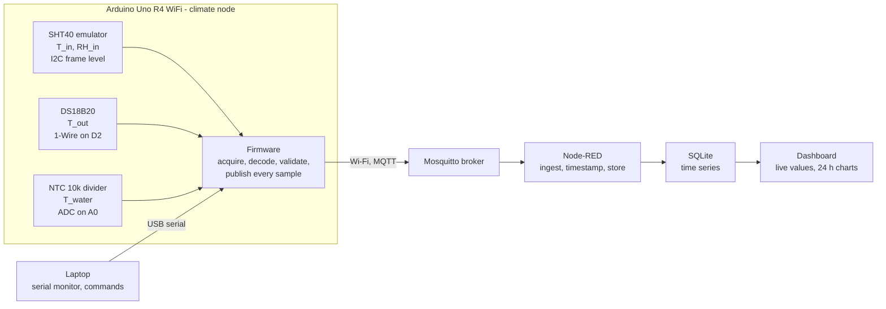
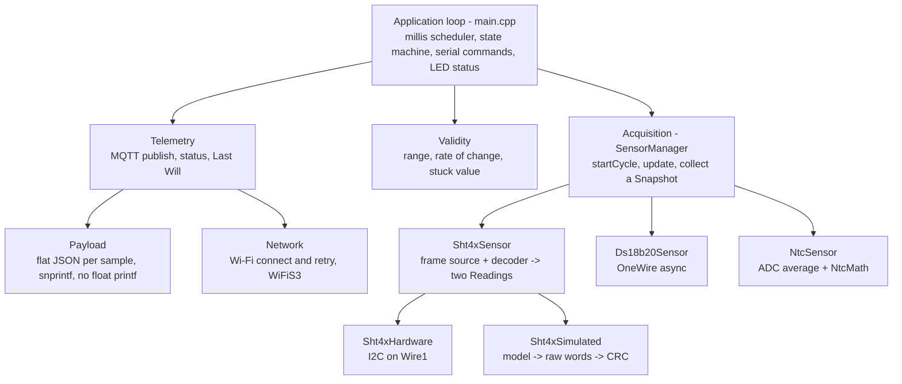
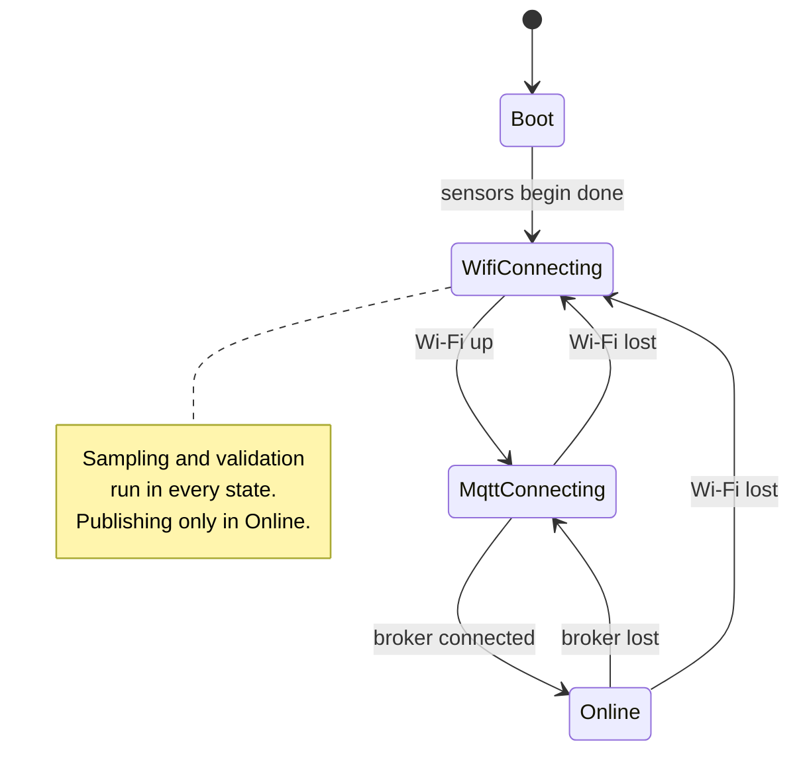
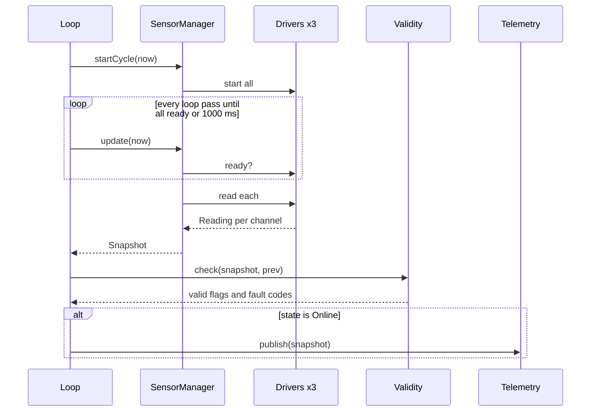

# Architecture outline v3 - MicroHydros climate node

Status: working version, 2026-09-04. Supersedes
`projekt1_architecture_outline_v2.md` (v2, kept unchanged for history).
Sources: customer letter "Forfragan om utveckling av prototyp for MicroHydros"
(HydroGreen Fingers AB, 2026-08-31), project brief "Projekt 1 MicroHydros"
(Jensen IoT25), Projektplan_Guide.pdf, the group's own decisions, and the
repository skeleton as it stands in `IoT25S-Projekt1-G1`.

## 0. What changed since v2

v2 was a plan. v3 describes the repository after the skeleton was built,
the pure modules were implemented and tested on a PC, and the remaining
bodies were reduced to contracts plus TODO markers for their owners.
Decisions that changed, with the reason:

- Toolchain is PlatformIO (VS Code extension or `pio` CLI) with the Arduino
  framework, not the Arduino IDE. PlatformIO is easier for Git; 
  it gives a proper `src/` and `lib/` split, a host-side test runner, recreatable project manifests via platformio.ini and
  `compile_commands.json` for editors. Section 5.5.
- No aggregation on the node. Every sample (default every 10 s) is published
  as one flat JSON object. The mean/min/max window, the "publish on fault
  change" rule and the `Aggregate` module are gone. Averaging is a query in
  the backend. Reason: irregular partial windows on fault changes mixed
  pre- and post-fault samples in one row, and 8640 rows per day is still
  nothing for SQLite. Sections 5.3, 5.4, 6.
- Validity keeps range, rate and stuck checks. The cross checks (`tIn`
  within a band of `tOut`, `tWater` of `tIn`) are dropped: they cannot
  tell a broken sensor from a lamp switching on, and blame the wrong
  channel when they fire. Section 5.2.
- Commands go over the USB serial port, not the MQTT cmd topic. The only
  demo use is switching the emulator scenario, and JSON parsing on the node
  without a library was more code than the feature was worth. The
  subscription plumbing stays in `Telemetry` for later. Section 5.4.
- No abstract `Sensor` base class. The SHT4x yields two channels from one
  frame, which did not fit a one-channel virtual interface, and with one
  static instance of each driver the polymorphism bought nothing.
  `Sensor.h` is now the written driver contract. Section 5.2.
- The JSON builder is a pure module (`lib/Payload`) with a unit test. It
  formats numbers itself: the Uno R4 core links newlib-nano without float
  `printf`, so `snprintf("%f")` prints nothing on the board. Section 5.6.
- Wi-Fi association and the MQTT connect block for seconds on WiFiS3 and
  ArduinoMqttClient. Documented as a limitation. Sections 5.3, 12.
- `Reading` gained a `raw` word (stuck detection needs it) and `Validity`
  is a class with per-channel counters, not free functions.

Kept from v2: Arduino Uno R4 WiFi, the sensor set and mapping, MQTT to a
local Mosquitto with Node-RED and SQLite behind it, the SHT4x frame-level
emulation seam, the non-blocking scheduler and state machine, the 4-week
plan, the requirement and risk tables.

## 1. Requirements derived from the customer letter and the brief

| ID  | Requirement                                                                     | Source                          | Priority                               |
| --- | ------------------------------------------------------------------------------- | ------------------------------- | -------------------------------------- |
| R1  | Measure air temperature inside the grow space                                   | Letter, brief 3.1               | Must                                   |
| R2  | Measure air temperature outside the grow space                                  | Letter, brief 3.1               | Must                                   |
| R3  | Measure water / nutrient solution temperature                                   | Letter, brief 3.1               | Must                                   |
| R4  | Measure relative humidity inside the grow space                                 | Letter, brief 3.1               | Must                                   |
| R5  | Measurements repeat at a fixed interval and form a time series                  | Letter, brief 3.1, 9.2          | Must                                   |
| R6  | Measurements are processed on the embedded device                               | Brief 9.3                       | Must                                   |
| R7  | Data leaves the device to an external system                                    | Letter, brief 5, 9.4            | Must                                   |
| R8  | Faulty or unreasonable readings and failure situations are detected and handled | Letter, brief 9.5               | Must                                   |
| R9  | Architecture documented so another developer understands it, with a diagram     | Brief 9.6, 10.3                 | Must                                   |
| R10 | No DHT11 / DHT22                                                                | Letter, brief 3.1               | Must                                   |
| R11 | Sensor choices motivated on technical criteria                                  | Letter, brief 4                 | Must                                   |
| R12 | Time series stored so history can be viewed                                     | Letter ("historiska matdata")   | Should                                 |
| R13 | Live and historic values visible in a simple dashboard                          | Derived from R12                | Should                                 |
| R14 | Threshold warnings (too warm, too cold)                                         | Letter, future analysis example | Could                                  |
| R15 | Several units can share one backend                                             | Letter, cloud vision            | Could (design for it, do not build it) |

Out of scope (brief 14): cloud platform, mobile app, advanced web UI, machine
learning, irrigation or lighting control, prediction, physical product design.

## 2. Decisions

| Area          | Decision                                                           | Motivation                                                                                                                                                         |
| ------------- | ------------------------------------------------------------------ | ------------------------------------------------------------------------------------------------------------------------------------------------------------------ |
| Board         | Arduino Uno R4 WiFi                                                | Group decision; Wi-Fi on board, 5 V and 3.3 V I/O, 14-bit ADC, LED matrix for status                                                                               |
| Toolchain     | PlatformIO, Arduino framework, C++                                 | Repo setup; `src/`+`lib/` split, host tests, compile database; the Arduino libraries are unchanged                                                                 |
| Communication | Wi-Fi + MQTT 3.1.1 to a local Mosquitto broker                     | Publish/subscribe matches the "many units, one service" vision (R15); tiny payloads; Last Will gives presence for free; trivially replaced by a cloud broker later |
| Backend       | Mosquitto + Node-RED + SQLite in one docker-compose                | Smallest stack that stores a time series (R12) and shows a chart (R13); Grafana/InfluxDB only if time remains                                                      |
| Inside T + RH | SHT40, emulated at the I2C frame level, hardware-swappable         | Section 3.1                                                                                                                                                        |
| Outside T     | DS18B20, real hardware                                             | Section 3.2                                                                                                                                                        |
| Water T       | NTC thermistor 10 k in a voltage divider on the ADC, real hardware | Section 3.3                                                                                                                                                        |
| Node output   | One flat JSON object per sample, no on-node averaging              | Section 0; simpler node, simpler table, no partial windows                                                                                                         |
| Node input    | Serial line commands; MQTT cmd topic reserved but not subscribed   | Section 0; demo needs only scenario switching                                                                                                                      |

Sensor mapping summary:

| Quantity    | Sensor   | Interface | Pin                                                 | Real / emulated |
| ----------- | -------- | --------- | --------------------------------------------------- | --------------- |
| T_in, RH_in | SHT40    | I2C, 0x44 | none now; Qwiic / `Wire1` when hardware is attached | emulated        |
| T_out       | DS18B20  | 1-Wire    | D2, 4.7 k pull-up to 5 V                            | hardware        |
| T_water     | NTC 10 k | analog    | A0, 10 k series resistor to 5 V                     | hardware        |

The mapping (DS18B20 in air, NTC in water) is a deliberate choice and is
discussed in 3.4, including the alternative of swapping them.

## 3. Sensor selection and motivation

The customer's earlier prototype failed on DHT11/DHT22 measurement quality and
stability. The three sensors below are argued against the criteria in the
brief. Verify every datasheet number before it goes into the project plan;
that datasheet reading is a week-1 task.

### 3.1 SHT40 - inside air temperature and relative humidity

| Criterion   | SHT40 (Sensirion SHT4x family)                                                                                | Comment                                             |
| ----------- | ------------------------------------------------------------------------------------------------------------- | --------------------------------------------------- |
| Range       | 0..100 %RH, -40..125 C                                                                                        | Covers a grow space with margin                     |
| Accuracy    | +/-1.8 %RH typ, +/-0.2 C typ                                                                                  | DHT22 is +/-2..5 %RH, DHT11 +/-5 %RH                |
| Resolution  | 0.01 %RH, 0.01 C (16-bit words)                                                                               |                                                     |
| Response    | tau63 about 4 s for RH                                                                                        | Fast enough for a small enclosure                   |
| Interface   | I2C, fixed address 0x44, 6-byte frame with CRC-8 per word                                                     | Standard bus, CRC makes transport errors detectable |
| Cost        | 40..100 kr on a breakout                                                                                      |                                                     |
| Power       | 1.08..3.6 V, about 0.4 uA idle, 0.4 mA during measure                                                         | Not relevant on USB power but good for a product    |
| Environment | Humid, warm, lamps nearby. SHT4x has good long-term stability and a built-in heater for condensation recovery | The exact weakness the customer hit with DHT        |

Datasheet facts the software relies on, now encoded in `lib/Sht4x/Sht4xTypes.h`:

- Measure command 0xFD, high precision, about 8 ms conversion (the driver
  waits 9 ms). 0xF6 and 0xE0 are the lower precision variants.
- Response frame: `T_MSB, T_LSB, CRC_T, RH_MSB, RH_LSB, CRC_RH`.
- CRC-8: polynomial 0x31, init 0xFF, no reflection, final XOR 0x00, per word.
  Datasheet test vector: CRC of `0xBE 0xEF` is `0x92` (a unit test).
- `RH[%] = -6 + 125 * S_RH / 65535`, clipped to 0..100.
  `T[C] = -45 + 175 * S_T / 65535`.
- Serial number command 0x89, same frame and CRC scheme.

Status in this prototype: emulated. The emulator produces the exact 6-byte
frame with valid CRC, so the decoder, validity checks and everything above
them run unchanged. A physical SHT40 breakout on the Qwiic connector (3.3 V,
`Wire1`) replaces the emulator with `SHT4X_SIMULATED 0` in `config.h`. This
is a documented limitation (section 12): the prototype does not physically
sense inside temperature or humidity, it demonstrates the full data path
for it.

### 3.2 DS18B20 - outside air temperature

| Criterion   | DS18B20                                                                             | Comment                                                            |
| ----------- | ----------------------------------------------------------------------------------- | ------------------------------------------------------------------ |
| Range       | -55..125 C                                                                          |                                                                    |
| Accuracy    | +/-0.5 C over -10..85 C, factory calibrated                                         | No calibration step needed                                         |
| Resolution  | 9..12 bit configurable; 12 bit = 0.0625 C                                           |                                                                    |
| Response    | Conversion 750 ms at 12 bit; thermal response tens of seconds in still air in TO-92 | Slow, but ambient air outside the unit changes slowly              |
| Interface   | 1-Wire, one data pin, 64-bit ROM ID per device, 9-byte scratchpad with CRC-8        | Many sensors on one pin; ID doubles as sensor identity in the data |
| Cost        | 15..40 kr TO-92, 30..60 kr as a sealed cable probe                                  |                                                                    |
| Power       | 3.0..5.5 V, about 1 mA during conversion                                            | 5 V from the Uno header, no level shifting                         |
| Environment | Room air; cable can be a few metres so the probe sits clearly outside the enclosure |                                                                    |

Why here and not elsewhere: outside air is the least demanding point (dry,
slow) and the DS18B20 gives a calibrated digital value with a CRC, so it
also serves as the reference when calibrating the NTC (section 3.3).

Fault signatures the firmware must recognise: no presence pulse (sensor
disconnected), scratchpad CRC failure (cable noise), the power-on reset value
85.0 C returned when a conversion never ran, and clone parts that ignore
resolution settings. Library: `OneWire` + `DallasTemperature`, used in
asynchronous mode (`setWaitForConversion(false)`) so the 750 ms conversion
never blocks the loop. The library reports both "no device" and "bad CRC"
as disconnected (`DEVICE_DISCONNECTED_RAW`), so both map to `NO_DEVICE`.
Option: 11-bit resolution halves the conversion to 375 ms at 0.125 C,
which is plenty for outside air; `DS18B20_RESOLUTION_BITS` in `config.h`.

### 3.3 NTC thermistor - water / nutrient solution temperature

Assumed part: 10 kOhm at 25 C, B25/85 about 3950 K, 1 % tolerance, glass or
epoxy bead. Verify against the actual part's datasheet.

| Criterion   | NTC 10 k in a divider                                                                                                                 | Comment                                                                 |
| ----------- | ------------------------------------------------------------------------------------------------------------------------------------- | ----------------------------------------------------------------------- |
| Range       | -40..125 C for the bead; the divider is designed for 5..40 C                                                                          | Nutrient solution stays well inside                                     |
| Accuracy    | 1 % R and 1 % B give about +/-1 C uncalibrated; about +/-0.3 C after a single-point calibration against the DS18B20                   | Calibration is part of the test plan                                    |
| Resolution  | Set by the ADC: 14-bit on the R4 gives about 0.02 C near 25 C                                                                         |                                                                         |
| Response    | A few seconds in water; water couples heat far better than air                                                                        | This is why the NTC goes in the water and not in the air                |
| Interface   | Analog voltage, one ADC pin, no protocol                                                                                              | Demonstrates the analog acquisition and calibration path                |
| Cost        | 5..20 kr                                                                                                                              | Cheapest of the three                                                   |
| Power       | 5 V across 20 k = 0.25 mA                                                                                                             | Self-heating about 0.6 mW at the NTC; in water this is well under 0.1 C |
| Environment | Immersed in a conductive nutrient solution, so the bead and leads must be sealed (heat-shrink with adhesive lining or a potted probe) | Sealing is a build task and a risk                                      |

Circuit: 5 V -> R_s 10 k -> A0 -> NTC -> GND. The divider is fed from the
same 5 V that is the ADC reference, so supply variation cancels:

    R_ntc = R_s * ADC / (ADC_max - ADC)
    1/T   = 1/T0 + (1/B) * ln(R_ntc / R0)        T in kelvin, T0 = 298.15 K

R_s = 10 k puts the best sensitivity around 25 C. `analogReadResolution(14)`
and 16 samples averaged per reading. The math is in `lib/NtcMath` with unit
tests; the constants (R_s, R0, B, offset) are in `config.h`.

Fault signatures: ADC at or near 0 means the NTC is shorted or R_s is open;
ADC near full scale means the NTC is open or unplugged. Both are mapped to
`NO_DEVICE`, never to a temperature (16 counts of margin at each rail).

### 3.4 Why this mapping, and the alternative

The two hardware sensors could be swapped: a sealed DS18B20 cable probe is
the more robust water sensor for a product, and an NTC works fine in room air.
The chosen mapping keeps the digital, calibrated sensor where it can act as a
reference and puts the fast, cheap sensor where its weaknesses (self-heating,
calibration need) are smallest - known tradeoff weighed against the cost and time delay of waiting for a sealed cable probe. It also exercises three different acquisition
paths (I2C frame, 1-Wire, analog), which is worth more in a first prototype
than two of the same. Possibilities for the next phase (section 12): use a
sealed DS18B20 probe for the water and a second one, or an NTC, for outside
air, and fit the real SHT40.

The honest caveat for the plan and the demo: this sensor set also matches
what the group already has. That is acceptable only because each choice
stands on its own criteria above; the plan should present the criteria, not
the availability.

## 4. System architecture



Everything right of the broker runs in one docker-compose on a laptop or a
Raspberry Pi. The broker is the seam towards the customer's future cloud
service: a cloud MQTT endpoint replaces the local broker with a config
change on the node.

## 5. Firmware architecture

### 5.1 Layers



Two seams matter. The driver contract (5.2) makes the three physical paths
look alike to `SensorManager`. Below it, the SHT4x frame seam is unchanged
from v1: `Sht4xSensor` sees six bytes whether they came from silicon or from
the emulator, and a bad CRC is rejected the same way in both cases.

A third boundary is the `lib/` versus `src/` split: everything in `lib/` has
no Arduino dependency and is compiled and unit-tested on the PC; everything
in `src/` touches the board.

### 5.2 Interface contracts

`Reading` (`lib/Reading`)

- `float value`, `bool valid`, `uint8_t fault`, `uint32_t sampledAtMs`,
  `uint32_t raw`. `raw` is the sensor word, used only for stuck detection.
- `fault` codes: `NONE`, `NO_DEVICE`, `CRC`, `TIMEOUT`, `RANGE`, `RATE`,
  `STUCK`, `NOT_READY`. `valid` is true only when `fault == NONE`.
  `faultName()` gives the string for logs.
- Helpers: `set(value, raw, nowMs)` marks valid; `fail(fault, nowMs)` sets
  `value` to NaN.

`Snapshot`

- `Reading tIn, rhIn, tOut, tWater`, `uint32_t seq`, `uint32_t uptimeMs`.

Driver contract (`lib/Sensor/Sensor.h`, text only, no base class)

- `bool begin()`: initialise; false if the device does not answer. Emulator
  always true. Called once from `setup()`.
- `void start(uint32_t nowMs)`: trigger one measurement. Returns immediately.
- `bool ready(uint32_t nowMs) const`: true when `read()` will not block.
  Implementations compare `nowMs` against the datasheet conversion time.
- `bool read(Reading& out, uint32_t nowMs)` for one channel, or
  `bool read(Reading& t, Reading& rh, uint32_t nowMs)` for the SHT4x: fill
  the readings, always set `fault` and `sampledAtMs`, return `valid`. On a
  transport failure `value` is NaN. Never blocks longer than about 20 ms.
  Not callable from an interrupt.
- Timing: SHT4x 8 ms (emulator: immediate), DS18B20 750 ms at 12 bit, NTC
  immediate (16 ADC reads, under 1 ms).

`Sht4xDecoder` (`lib/Sht4x`, pure functions)

- `uint8_t crc8(const uint8_t* data, size_t len)`
- `bool decode(const uint8_t frame[6], float& tC, float& rh)`: false if
  either CRC fails; outputs untouched on false; RH clipped to 0..100.
- `wordToTemperature`, `wordToHumidity`, `temperatureToWord`,
  `humidityToWord`, `encode(tWord, rhWord, frame)` for the emulator and tests.

`Sht4xFrameSource` (abstract, `lib/Sht4x`)

- `begin()`, `startMeasurement(nowMs)`, `frameReady(nowMs)`,
  `readFrame(out[6])`. `readFrame` returns false on a transport failure and
  does not check CRC. Implemented by `Sht4xHardware` (src) and
  `Sht4xSimulated` (lib).

`Sht4xSimulated`

- Model: `T_in = T_ref + lampOffset(t) + drift + noise`, where `T_ref` is a
  constant or, via `setReferenceTemperature()`, the latest valid `T_out`
  reading so the demo stays physically coherent. `RH_in` from a simple
  inverse relation to `T_in` plus a base level and noise. Scenarios by
  `setScenario()` or `setScenarioByName()`: `steady`, `heatup` (lamp on
  ramp), `cooldown`, `stuck` (same raw words every frame), `badcrc` (valid
  words, corrupted CRC).
- Status: frame building, scenario selection and `badcrc` are implemented
  and tested; the model itself returns constants (`TODO(emulator)`).

`NtcMath` (`lib/NtcMath`, pure functions)

- `adcIsShort`, `adcIsOpen`, `adcPlausible`, `resistanceFromAdc`,
  `temperatureFromResistance`, `temperatureFromAdc`, with a `Params` struct
  (R_s, R0, B, T0, calibration offset). Tested at the 25 C midpoint and two
  beta-equation points.

`Validity` (`lib/Validity`, class with per-channel stuck counters)

- `void check(Snapshot& s, const Snapshot& prev)`: applies, per channel,
  physical range, maximum rate of change against `prev` (time delta from
  `sampledAtMs`), and stuck detection (N identical `raw` values in a row).
  Downgrades `valid` and sets `fault`, never changes `value`. Channels that
  are already invalid keep their driver-level fault.
- Default limits (tune in week 2): T_in 5..45 C, T_out -20..45 C, T_water
  5..40 C, RH 5..100 %; rate limit 2 C/min for air, 1 C/min for water,
  5 %RH/min; stuck after 30 identical raw readings.
- Status: limits and structure in place, rules are `TODO(validity)`.

`Payload` (`lib/Payload`, pure)

- `int buildTelemetryJson(char* buf, size_t len, const Snapshot&, const SourceInfo&)`:
  snprintf semantics (returns the full length, so `>= len` means truncated),
  buffer always terminated. Numbers are formatted as fixed-point integers
  with one decimal. Invalid channels are `null`. Format in 5.4. Tested
  against the exact expected string.

`SensorManager` (`src/sensors`)

- Owns the three drivers. `startCycle(nowMs)` calls `start()` on all;
  `update(nowMs, Snapshot&)` is called every loop pass and returns true
  exactly once per cycle, when all drivers are ready or 1000 ms has passed,
  with the snapshot filled in. A driver that is not ready by the deadline
  gets `TIMEOUT`; a driver that fails keeps its slot with `valid=false`;
  the other channels are unaffected. This is requirement R8 at the
  acquisition level: one broken sensor never stops the others.

`Network` (`src/net`)

- `begin()` false if the Wi-Fi module does not answer. `poll(nowMs)`
  refreshes the status and re-issues `WiFi.begin()` at most every
  `WIFI_RETRY_MS` while disconnected. `connected()`, `rssi()`.

`Telemetry` (`src/net`)

- Config struct with host, port, credentials, client id, topics, retry and
  keep-alive intervals. `begin()`, `poll(nowMs)` (keep-alives, reconnect at
  most every `MQTT_RETRY_MS`), `connected()`,
  `publish(const Snapshot&, const SourceInfo&)`. Last Will `offline`,
  retained, on the status topic; `online` published retained on connect.
  `onCommand()` and the cmd subscription exist but the topic is not
  subscribed (5.4).

`SerialCommand` (`src/ui`)

- Line-based commands from the USB serial port, handler gets the first word
  and the rest: `scenario <name>` (emulator only), `sample <seconds>` with a
  2 s floor, `help`.

`StatusLed` (`src/ui`)

- `show(state, faultPresent)`, `blinkPublish(nowMs)`, `update(nowMs)` over
  the 12x8 LED matrix. Frame format from the `Arduino_LED_Matrix` example.

Selection between emulator and hardware: `#define SHT4X_SIMULATED 1` in
`config.h`.

### 5.3 Runtime behaviour

Non-blocking loop on `millis()` timers. Sampling and validation run in
every state; publishing only when Online.



Known blocking spots: `WiFi.begin()` on WiFiS3 stalls for a few seconds
while the module associates, and the MQTT connect for up to
`MQTT_CONNECT_TIMEOUT_MS` (5 s). Sampling pauses during a reconnect attempt
and resumes afterwards. The DS18B20 timing is `millis`-based, so a late
read is still a correct read. Accepted for the prototype and listed in
section 12.

Sample cycle:



How often to measure (a customer question): the enclosure is small, so air
temperature can move a degree in a minute when the lamps switch, but nothing
in the grow space changes meaningfully in seconds. Default: sample and
publish every 10 s. That gives 8640 rows per day, which SQLite handles for
years, and enough resolution to see lamp cycles. Trend views average in
the backend with a query, which is where the outline already placed trend
analysis. The interval is a `config.h` constant and can be changed at
runtime with the serial `sample` command. The answer for the plan: 10 s
sampling and storage; if storage ever matters, 1 or 5 min averages computed
in the backend are still plenty for trend analysis.

### 5.4 MQTT topics and payload

- `microhydros/<device_id>/telemetry`, one flat JSON object per sample,
  built by `lib/Payload`:
  
      {"seq":123,"uptime_s":4567,
       "t_in":24.1,"rh_in":61.0,"t_out":20.3,"t_water":null,
       "faults":{"t_in":0,"rh_in":0,"t_out":0,"t_water":1},
       "src":{"sht40":"sim","ds18b20":"hw","ntc":"hw"}}
  
  An invalid channel publishes `null` and a non-zero fault code, never a
  fake number and never a missing key, so the gap and its reason are
  visible in the history. Payload is about 170 bytes; buffer 256, built
  with `snprintf`, no JSON library.

- `microhydros/<device_id>/status`: `online` / `offline`, retained, with
  `offline` as Last Will.

- `microhydros/<device_id>/cmd`: reserved, not subscribed in this
  prototype. Commands go over the USB serial port (5.2, `SerialCommand`).

Data representation (a documentation deliverable): units are C and %RH,
floats with one decimal in transit, raw sensor words kept only inside the
drivers (and in `Reading.raw` for stuck detection). The node has no
real-time clock, so the backend stamps each row on ingest and the node
supplies `seq` and `uptime_s` for ordering and gap detection. `device_id`
in the topic is what makes R15 possible without touching the backend.

### 5.5 Repository layout (PlatformIO project)

```
platformio.ini            envs: uno_r4_wifi (board), native (PC tests);
                          every build also writes compile_commands.json
compiledb.py              extra script: toolchain includes in the compile db
src/                      Arduino-dependent code, one directory per area
  main.cpp                setup(), loop(), scheduler, state machine
  config.h                intervals, limits, pins, SHT4X_SIMULATED, topics
  secrets.h.example       template; copy to secrets.h (git-ignored)
  sensors/
    SensorManager.h/.cpp  startCycle / update / collect
    Ds18b20Sensor.h/.cpp  OneWire async, fault mapping
    NtcSensor.h/.cpp      ADC average, calls NtcMath
    sht4x/
      Sht4xSensor.h/.cpp  adapter: frame source + decoder -> two Readings
      Sht4xHardware.h/.cpp I2C on Wire1
  net/
    Network.h/.cpp        Wi-Fi state handling
    Telemetry.h/.cpp      MQTT client, status, Last Will
  ui/
    StatusLed.h/.cpp      LED matrix frames
    SerialCommand.h/.cpp  line parser for serial commands
lib/                      pure C++, no Arduino, compiled for board and PC
  Reading/                Reading, Snapshot, fault codes
  Sensor/                 driver contract (text)
  Sht4x/                  Sht4xTypes, Sht4xDecoder, Sht4xFrameSource, Sht4xSimulated
  NtcMath/                divider and beta equation
  Validity/               range, rate, stuck
  Payload/                JSON builder
test/test_native/         Unity tests for lib/, `pio test -e native`
examples/                 unmodified library examples the modules derive from
backend/                  docker-compose, mosquitto.conf, backend README
README.md                 build, layout, where to start, runtime notes
```

Includes: headers under `src/` subdirectories are included with their
directory (`#include "net/Network.h"`); `lib/` headers are included bare.

Build and run:

    cp src/secrets.h.example src/secrets.h
    pio run                    build (also regenerates compile_commands.json)
    pio run -t upload          flash
    pio device monitor         serial log, 115200 baud
    pio test -e native         PC tests of lib/

Libraries, declared in `platformio.ini`: `ArduinoMqttClient`, `OneWire`,
`DallasTemperature`. `WiFiS3`, `Wire` and `Arduino_LED_Matrix` come with
the board core. Nothing for the NTC, the emulator or the payload. The
HiTECH Wi-Fi manager that was in the initial config is commented out;
`examples/BasicAutoConnect` shows what it does if a captive-portal setup
is ever wanted.

Memory after the skeleton build: about 6 KB of 32 KB RAM, 59 KB of 256 KB
flash.

### 5.6 Toolchain notes

- The Uno R4 core links with `--specs=nano.specs` and does not pull in
  float `printf`. `snprintf("%f")` produces an empty field on the board.
  `Serial.print(float)` is unaffected because `Print` formats floats
  itself. `Payload` formats numbers as integers for this reason; do not
  reintroduce `%f` elsewhere.
- `pio test -e native` builds only `lib/` modules that the test file pulls
  in, so `lib/` may never include Arduino headers. Anything that does
  belongs in `src/`.
- The compile database includes the cross-toolchain's system include paths
  (`compiledb.py`), so clangd resolves `<Arduino.h>` and the C++ headers
  against arm-none-eabi.

## 6. Backend and history

One docker-compose (`backend/`) with Mosquitto 2 and Node-RED, named
volumes for both. Node-RED subscribes to `microhydros/+/telemetry`, stamps
`received_at`, takes `device_id` from the topic, and inserts one row per
message into SQLite. The table matches the flat payload one to one:

    telemetry(received_at, device_id, seq, uptime_s,
              t_in, rh_in, t_out, t_water,
              fault_t_in, fault_rh_in, fault_t_out, fault_t_water)

Averages for trend views are `AVG(...) GROUP BY` over stored rows. A second
`mqtt in` on `microhydros/+/status` feeds a last-seen indicator.

Dashboard: current values with fault indication, 24 h line chart per channel,
last-seen per device from the status topic. Node-RED dashboard is enough for
the brief; Grafana is the upgrade path if someone has spare time in week 3.

Status: compose file, broker config and a README with the test commands
(`mosquitto_sub`, a `mosquitto_pub` line that fakes a node message) exist.
Flow, table and dashboard are the backend area's work.

## 7. Wiring

| Pin             | Use                                | Notes                                                                            |
| --------------- | ---------------------------------- | -------------------------------------------------------------------------------- |
| D2              | DS18B20 data                       | 4.7 k pull-up to 5 V; VDD to 5 V, GND to GND (no parasite power)                 |
| A0              | NTC divider midpoint               | 10 k 1 % from 5 V to A0, NTC from A0 to GND; 100 nF from A0 to GND against noise |
| Qwiic / `Wire1` | SHT40 breakout if one is fitted    | 3.3 V I2C, no level shifting                                                     |
| LED matrix      | Status                             | Wi-Fi state, fault present, publish blink                                        |
| USB-C           | Power, serial log, serial commands | No battery, the energy section is one paragraph                                  |

Water probe build: NTC bead soldered to a twisted pair, sealed in adhesive
heat-shrink, then a second layer, then tested for leakage resistance (megohm
range) before it goes into nutrient solution.

## 8. Mapping to the brief's deliverables

| Brief item                    | What goes there                                                                                                                                                                                                               |
| ----------------------------- | ----------------------------------------------------------------------------------------------------------------------------------------------------------------------------------------------------------------------------- |
| 10.1 Projektplan              | Summary of the letter; R1..R15 with priorities; out of scope list; backlog from section 9 below; time plan (section 9); roles per section 9.1                                                                                 |
| 10.2 Repository README        | Exists: purpose, PlatformIO build, libraries, `secrets.h` from the example, layout, where to start, runtime notes; add `docker compose up` and how to see data when the backend lands                                         |
| 10.3 Technical documentation  | Sections 2..7 of this outline become architecture.md and sensors.md; data representation is 5.4; toolchain notes 5.6; known limitations is section 12                                                                         |
| 10.4 Testing                  | Section 11, with an actual-result column filled in during week 3 and 4, plus the plausibility discussion; the native tests are the component part and already run                                                             |
| 10.5 Demo                     | Live chain: node on the bench, DS18B20 warmed by hand, NTC in a cup of water with a kettle refill, emulator scenario switched over the serial monitor, chart on the dashboard, a sensor unplugged live to show fault handling |
| 9 Technical requirements 1..6 | R1..R4 and R5 (section 5.3), R6 (section 5.1), R7 (5.4), R8 (5.2 Validity and SensorManager), R9 (this document)                                                                                                              |

## 9. Four-week time plan (31 Aug - 25 Sep 2026)

| Week | Focus (brief 11)                                                                                                | Deliverable                                                                                               |
| ---- | --------------------------------------------------------------------------------------------------------------- | --------------------------------------------------------------------------------------------------------- |
| 1    | Requirements, sensor research, datasheets, plan, backlog; repo skeleton; PC build of decoder, payload, NTC math | Project plan submitted; skeleton builds; native tests run (done 2026-09-04); broker + Node-RED compose up |
| 2    | Firmware bodies per area: drivers, state machine, Wi-Fi + MQTT publish; emulator model; Validity rules          | Node publishes all four channels to the broker; NTC calibrated against DS18B20                            |
| 3    | Storage and dashboard; validity limits tuned on real data; reconnect behaviour; test execution starts           | End-to-end demo working; tests.md half filled                                                             |
| 4    | Remaining tests, fixes, documentation, demo rehearsal, individual reflection                                    | Test results, technical documentation, demo, reflections                                                  |

Nothing waits for the dashboard. Each body compiles against its header from the first line, so areas can proceed in parallel; the `TODO(<area>)` markers in the code list the steps and the library example to adapt.

### 9.1 Responsibility split

Five areas, one owner each. The owner drives the area, writes its code and
its part of the documentation and tests, and is the person to ask about it.

| #   | Area                    | Owner  | Covers                                                                                                                                                                                                                                                | Left to do                                                                                                                                 |
| --- | ----------------------- | ------ | ----------------------------------------------------------------------------------------------------------------------------------------------------------------------------------------------------------------------------------------------------- | ------------------------------------------------------------------------------------------------------------------------------------------ |
| 1   | Sensor emulation layer  | Rasmus | `lib/Sht4x` (types, decoder, frame source, emulator), `src/sensors/sht4x` (adapter, I2C hardware), `lib/Payload`; section 3.1 and the emulator parts of 5.2                                                                                           | Emulator model and scenario tests; SHT40 hardware bring-up if bought; glue and help.                                                       |
| 2   | Backend                 | Stas   | `backend/`: docker-compose, Mosquitto config, Node-RED flows, SQLite table and dashboard; section 6                                                                                                                                                   | Flow, table, dashboard, status/last-seen, flow export, backend docs                                                                        |
| 3   | Arduino side networking | Ali    | `src/net` (Network, Telemetry), `src/ui/SerialCommand`, `secrets.h.example`; Wi-Fi and MQTT state handling, topics and payload in 5.4                                                                                                                 | Connect and retry bodies, Last Will & Testament(MQTT Feature), publish, serial parser; reconnect tests with AP and broker pulled; back-off |
| 4   | Sensor readings         | Zaka   | `src/sensors/NtcSensor`, `lib/NtcMath`, `lib/Reading`, `lib/Sensor` (contract), `lib/Validity`; the driver contract in 5.2, NTC circuit and calibration in 3.3                                                                                        | Validity rules with tests; NTC circuit, probe sealing, calibration, limit tuning on real data. DS18B20 driver(Linus or Zaka)               |
| 5   | Arduino firmware        | Linus  | `src/main.cpp` (scheduler, state machine, LED and command wiring), `src/sensors/Ds18b20Sensor`, `src/ui/StatusLed`, `config.h`, `src/sensors/SensorManager`, and the pre-made libraries `WiFiS3`, `OneWire`, `DallasTemperature`, `ArduinoMqttClient` | State machine, publish trigger,  LED frames, command handler, hardware bring-up. DS18B20 driver(Linus or Zaka)                             |

Rasmus also glues the pieces together where work falls between areas,
handles communication between the subsystems (for example the Snapshot to
JSON to SQLite column mapping across areas 3, 4 and 2), and is generally
available to help and answer questions.

Changes from v2's split, to be confirmed at the planning meeting:
`SerialCommand` goes to area 3 (it is the command path that replaced the
cmd topic); `Validity` to area 4; `Ds18b20Sensor`(4 or 5?), `SensorManager` and
`config.h` to area 5; `Payload` to area 1 as glue. `test/` and `docs/` are
shared: whoever fills in a `lib/` body adds its test.

## 10. Risks

| Risk                                                                    | Probability | Impact | Mitigation                                                                                                                                            |
| ----------------------------------------------------------------------- | ----------- | ------ | ----------------------------------------------------------------------------------------------------------------------------------------------------- |
| Emulated inside T/RH is judged as not meeting "four measurement points" | Medium      | High   | State it up front in the plan as a design decision with the hardware swap path; keep a real SHT40 breakout as a week-3 purchase option (about 100 kr) |
| NTC probe leaks in nutrient solution                                    | Medium      | Medium | Double heat-shrink, leakage test before immersion, spare probe                                                                                        |
| NTC reads 1..2 C off                                                    | High        | Low    | Single-point calibration against DS18B20 in the same bath is in the plan; document the residual error                                                 |
| DS18B20 clone behaves oddly (resolution, 85 C)                          | Medium      | Medium | Buy from a known distributor; the 85 C and CRC fault paths are tested explicitly; `examples/Tester` prints what the part reports                      |
| WiFiS3 / MQTT reconnect misbehaves                                      | Medium      | Medium | State machine with retry intervals; test by pulling the AP and stopping the broker; blocking connects are known (5.3)                                 |
| Example-derived bodies untested on hardware                             | Medium      | Low    | Each area brings its own part up on the bench in week 2 before integration                                                                            |
| Three sensors and a scheduler grow messy                                | Low         | Low    | Fixed layout by area, one class per sensor, contracts in headers, PR review on each driver                                                            |
| Uno R4 SRAM (32 KB) with libraries                                      | Low         | Medium | Skeleton uses about 6 KB; `snprintf` payloads, no JSON library, check free RAM in the serial log                                                      |
| Schedule slip                                                           | Medium      | Medium | Core chain by end of week 2; dashboard polish and LED frames are the first things dropped                                                             |

## 11. Test plan

Each test is recorded as what / how / expected / actual (brief 10.4).

Component (`pio test -e native`, 9 tests pass as of 2026-09-04)

- `crc8` against the SHT4x datasheet test vector (done).
- `decode` with a known-good frame, a corrupted CRC, and boundary words
  0x0000 and 0xFFFF (clipping) (done).
- Emulator: `steady` decodes, `badcrc` does not, unknown scenario name is
  refused (done); `heatup`, `cooldown`, `stuck` behaviour (when the model
  is written).
- NTC: 25 C midpoint, two beta-equation points, short/open ADC values
  flagged (done).
- Payload: exact string for a snapshot with one invalid channel and a
  negative value; truncation reported (done).
- Validity: a snapshot outside range, a jump above the rate limit, 30 stuck
  readings, each produce the right fault code and leave `value` untouched
  (when the rules are written).

Integration (on the board, serial log)

- Each sensor alone: `begin`, `start`, `ready` timing within datasheet
  limits, `read` values plausible.
- DS18B20 unplugged while running: `NO_DEVICE` within one sample, other
  channels unaffected, recovers when replugged.
- NTC shorted / open: fault code, no temperature published.
- Broker stopped and restarted: node reconnects, publishing resumes, `seq`
  shows the gap.
- Wi-Fi AP off and on: same.
- `sample 2` over serial changes the cadence; `sample 1` is refused.

System

1. Node boots with emulator scenario `steady`; all four channels valid on
   the dashboard within two samples.
2. `scenario heatup` over the serial monitor; T_in rises on the chart, RH
   falls.
3. Warm the DS18B20 by hand; T_out rises by a few degrees and returns.
4. Move the NTC from room water to warm water; T_water follows within a few
   seconds; compare against the DS18B20 dipped in the same water.
5. Unplug the DS18B20; dashboard shows the fault, the other three continue.
6. Leave the system running overnight; the SQLite table has about 8640 rows
   with no gaps beyond the ones caused on purpose.

Plausibility (brief 10.4 asks for this reasoning)

- T_out should sit near a reference room thermometer, within 1 C.
- T_water in a room-temperature cup should converge to T_out within 1 C
  after 15 min.
- The NTC and DS18B20 in the same water bath should agree within 0.5 C after
  calibration.
- RH_in from the emulator is only as plausible as its model; state that.

## 12. Known limitations and recommendations for the next phase

Limitations of this prototype

- Inside temperature and humidity come from an emulated SHT40. The data
  path is real, the measurement is not. A physical SHT40 on Qwiic removes
  this with a config change.
- The NTC needs calibration and a hand-built seal; its absolute accuracy is
  documented from the calibration, not from a datasheet. The beta equation
  is used, not Steinhart-Hart.
- No real-time clock on the node; timestamps are assigned by the backend.
- Wi-Fi association and the MQTT connect block the loop for seconds;
  sampling pauses during reconnect attempts.
- Local broker only; no TLS, no authentication beyond a username/password.
- No alarm logic beyond fault codes and optional fixed thresholds.
- Commands only over USB serial; the MQTT cmd topic is reserved, not used.

Recommendations for improvements (theoretical unless decided otherwise)

- Use a sealed DS18B20 probe for the water in a product; keep the NTC path
  as the low-cost option or for a second water point.
- Move the broker to a managed MQTT endpoint with TLS when the cloud service
  is chosen; the node needs only a new host, port and credentials.
- Add an RTC or NTP time on the node so offline samples can be buffered and
  back-filled with correct timestamps (`examples/WiFiUdpNtpClient` and
  `examples/RTC_NTPSync` are the starting points).
- Trend and anomaly detection belongs in the backend on the stored series,
  not on the node.

## 13. Open decisions

1. Buy a real SHT40 breakout now (about 100 kr) to close the biggest risk in
   section 10, or stay emulated for the whole prototype?
2. Exact NTC part and its B value; single-point or three-point calibration.
3. Backend host: laptop or Raspberry Pi. Affects whether the overnight test
   in section 11 is practical.
4. Dashboard: Node-RED dashboard or Grafana.
5. DS18B20 resolution: 12 bit (750 ms) or 11 bit (375 ms).
6. Confirm the ownership changes in 9.1 (`SerialCommand` to area 3,
   `Validity` to area 4,  `SensorManager`, `config.h` to
   area 5). `Ds18b20Sensor`, to 4 or 5.
