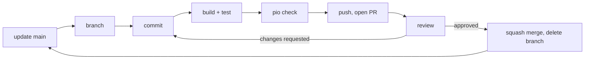

# How code gets into main

Nothing is committed to `main` directly. Every change, any size, any
author: branch, pull request, one approval, squash merge. No exceptions.



## 1. Update main

    git switch main
    git pull --ff-only

If `--ff-only` refuses, you have local commits on `main`. See section 7.

## 2. Branch

    git switch -c <area>/<card>-<what>

Lowercase, hyphens. `<area>` is the board label without `area:`,
`<card>` the card id: `emulation/e1-lamp-ramp`, `sensors/s2-validity-tests`,
`shared/d10-tests-md`. One card per branch.

## 3. Commit

Small commits, each one compiling. Subject line in the imperative, at
most 72 characters; a body when the why is not obvious.

    Emulator: ramp T_in with lampTauMs in HEATUP and COOLDOWN

    Exponential approach to tRefC + lampRiseC so the chart shows a curve,
    not a step.

Never `git add -A` without reading `git status`. `src/secrets.h`,
`.pio/` and `compile_commands.json` stay out.

## 4. Build and test

    pio run                  # firmware builds
    pio test -e native       # native tests pass
    pio check                # runs cppcheck and clangtidy
 Warnings and static analysis

pio run now shows compiler warnings for our own code. It did not before: the Arduino core passes -w, which muted everything. Fix warnings in files you touch before opening a PR. A warning in a file you did not touch is not yours.
 
Before opening a PR, also run:
 
pio check -e uno_r4_wifi
The first run downloads cppcheck and clang-tidy, after that it takes about 90 seconds. It checks src/ and lib/ only. Read the lines that name your files. Severity medium and high you fix or explain in the PR body. low is style; fix it if it is cheap.
 
If a finding is wrong for a good reason, silence it on that line and say why:

 ```
  // cppcheck-suppress unreachableCode ; why
  foo();  // NOLINT(bugprone-narrowing-conversions) why
  What it does and does not catch: the compiler and the analyzers find dead code after a return, sign mix-ups, unused 
  // cppcheck-suppress unreachableCode ; why
  foo();  // NOLINT(bugprone-narrowing-conversions) why
 ```
  What it does and does not catch: the compiler and the analyzers find dead code after a return, sign mix-ups, unused parameters and uninitialised members. 
  They do not find an inverted condition or a wrong state transition. Those only fall to running the code on the board or to the reviewer.
 
Settings live in `platformio.ini` `(check_*)`, `.clang-tidy` and `unmute_warnings.py`

If `main` moved, rebase now, before anyone reviews:

    git fetch origin
    git rebase origin/main

## 5. Push and open the PR

    git push -u origin <branch>
    gh pr create --base main --fill      # or the banner on GitHub

Title: the card title. Body:

    ## What
    ## Why            (link the card)
    ## How it was tested   (commands and result, or what / how / expected / actual)
    ## Notes for the reviewer

Reviewer: the area owner, or anyone else if you are the owner. Two areas
touched, both owners. Move the card to `Review`.

Not finished yet? Open it as a draft (`--draft`) and mark it ready when
section 4 is done.

## 6. Review and merge

Reviewer checks: does what the card says and nothing more; headers,
bodies and tests agree; no Arduino includes in `lib/`; no `%f`; no
secrets; PR body says how it was tested. Comments go on the diff.
Request changes or approve. The reviewer does not push to the branch.

Author answers every comment with a reply or a new commit. No rebase or
force-push once review has started. Re-request review until approved.

Then, the author:

1. If `main` moved: "Update branch" on GitHub (or `git merge origin/main`),
   rebuild, retest, push.
2. **Squash and merge.** Message: PR title plus the What and Why.
3. Delete the branch. Card to `Done`.
4. `git switch main && git pull --ff-only`.

Conflicts: merge `origin/main` into the branch, resolve the markers,
rebuild, retest, push. A conflict in a header contract is settled by
talking to the other author first.

## 7. Undo

- **Commits on local main, not pushed:**
  `git switch -c <branch>`, then `git switch main && git reset --hard origin/main`.
- **Pushed to main by mistake:** never rewrite `main`. Tell the group and
  open a PR that reverts it, or a PR asking for a review of the commit
  that is already there.
- **Merged PR is wrong:** the "Revert" button on the PR opens a new PR.
- **Branch is a mess:** new branch from `main`, `git cherry-pick` what
  is worth keeping, delete the old one.


Until then it is a team rule. A push to `main` is visible in the history
and is handled as in section 7.
